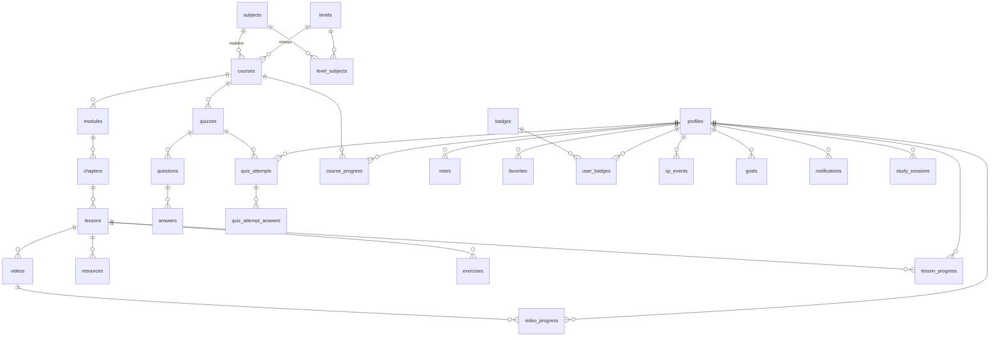

# EduLearn — Schéma de base de données (ÉTAPE 1)

PostgreSQL 15+ (Supabase). Conception complète : tables, relations, contraintes, index, RLS.
Ce document est la **spécification** ; il devient les migrations `supabase/migrations/000X_*.sql` à partir de l'étape 3.

---

## 1. Vue d'ensemble

23 tables + 2 vues, réparties en 5 domaines :

| Domaine | Tables |
|---|---|
| Identité | `profiles`, `user_subject_interests` |
| Contenu | `levels`, `subjects`, `level_subjects`, `courses`, `modules`, `chapters`, `lessons`, `videos`, `resources` |
| Évaluation | `quizzes`, `questions`, `answers`, `quiz_attempts`, `quiz_attempt_answers`, `exercises`, `exercise_attempts` |
| Progression | `video_progress`, `lesson_progress`, `course_progress`, `study_sessions` (+ vues `v_chapter_progress`, `v_module_progress`) |
| Engagement | `notes`, `favorites`, `badges`, `user_badges`, `xp_events`, `goals`, `goal_periods`, `notifications`, `notification_preferences` |



---

## 2. Trois décisions de modélisation à valider

### 2.1 Les matières sont globales, pas dupliquées par niveau

La hiérarchie demandée est `NIVEAU → MATIÈRE → COURS`. Deux modélisations possibles :

- **(A)** `subjects.level_id` → « Mathématiques » existe en 4 exemplaires (Seconde, Première, Terminale…), avec 4 icônes, 4 couleurs, 4 descriptions à maintenir en cohérence.
- **(B) retenue** : `subjects` global, et `courses(level_id, subject_id)`. La table de liaison `level_subjects` définit quelles matières sont proposées pour un niveau et dans quel ordre.

(B) donne exactement la navigation demandée (`Terminale → Mathématiques → Analyse`) sans duplication, permet à un élève de suivre « Mathématiques » à travers plusieurs niveaux, et rend possible le filtre `/explore?subject=maths` tous niveaux confondus.

### 2.2 `course_id` dénormalisé sur `chapters`, `lessons`, `quizzes`

Sans lui, « toutes les leçons du cours X » impose `lessons ⋈ chapters ⋈ modules ⋈ courses` — sur chaque page de cours, chaque calcul de progression et **dans chaque policy RLS**. La colonne est remplie par trigger depuis le parent (jamais par l'application) : la cohérence est garantie par la base, pas par la discipline du développeur.

### 2.3 Chapitres et modules : vues, pas tables

Le cahier demande de savoir si un chapitre/module est terminé. Plutôt que deux tables supplémentaires à maintenir par trigger (risque de désynchronisation), ce sont des **vues** dérivées de `lesson_progress` : un chapitre est terminé quand toutes ses leçons publiées le sont. Une seule source de vérité. `course_progress`, lui, **est** matérialisé car il est lu sur le dashboard à chaque chargement.

---

## 3. Extensions et types

```sql
create extension if not exists pgcrypto;   -- gen_random_uuid()
create extension if not exists unaccent;   -- recherche insensible aux accents

create type user_role        as enum ('student','teacher','admin');
create type content_status   as enum ('draft','published','archived');
create type difficulty_level as enum ('beginner','intermediate','advanced');
create type video_provider   as enum ('native','youtube','google_drive','cloudflare_stream','vimeo');
create type resource_type    as enum ('pdf','document','image','link','file','archive');
create type question_type    as enum ('single_choice','multiple_choice','true_false','short_answer');
create type quiz_scope       as enum ('lesson','chapter','course');
create type progress_status  as enum ('not_started','in_progress','completed');
create type exercise_kind    as enum ('open_answer','numeric','file_upload','interactive');
create type goal_type        as enum ('daily_minutes','weekly_minutes','daily_lessons','weekly_lessons');
create type notification_type as enum ('new_course','new_lesson','new_quiz','goal_reached','badge_earned','study_reminder','system');
create type xp_reason        as enum ('lesson_completed','quiz_passed','course_completed','badge_earned','streak_bonus','goal_reached');
```

Toutes les tables portent `created_at timestamptz not null default now()` et, sauf mention contraire, `updated_at timestamptz not null default now()` alimenté par le trigger `set_updated_at()`.

---

## 4. Identité

```sql
create table profiles (
  id                  uuid primary key references auth.users(id) on delete cascade,
  first_name          text,
  last_name           text,
  avatar_url          text,
  role                user_role not null default 'student',
  level_id            uuid references levels(id) on delete set null,
  bio                 text,
  xp                  integer not null default 0 check (xp >= 0),
  streak_current      integer not null default 0,
  streak_longest      integer not null default 0,
  last_activity_date  date,
  onboarding_done     boolean not null default false,
  is_active           boolean not null default true,
  timezone            text not null default 'Europe/Paris',
  created_at          timestamptz not null default now(),
  updated_at          timestamptz not null default now()
);

create index profiles_role_idx     on profiles(role);
create index profiles_level_id_idx on profiles(level_id);

create table user_subject_interests (
  user_id    uuid not null references profiles(id) on delete cascade,
  subject_id uuid not null references subjects(id) on delete cascade,
  created_at timestamptz not null default now(),
  primary key (user_id, subject_id)
);
```

- `profiles.id` est **la même clé** que `auth.users.id` : pas de table utilisateur parallèle.
- La ligne est créée automatiquement par le trigger `handle_new_user()` sur `auth.users`.
- `is_active = false` = compte désactivé par l'admin (exigence §19) ; la garde de session refuse la connexion.
- `xp`, `streak_*` sont des **caches** ; la vérité est dans `xp_events` et `study_sessions`. Un trigger interdit leur modification directe par l'utilisateur.

---

## 5. Contenu

```sql
create table levels (
  id          uuid primary key default gen_random_uuid(),
  slug        text not null unique,
  name        text not null,
  description text,
  sort_order  integer not null default 0,
  status      content_status not null default 'draft',
  created_at  timestamptz not null default now(),
  updated_at  timestamptz not null default now()
);
create index levels_order_idx on levels(status, sort_order);

create table subjects (
  id          uuid primary key default gen_random_uuid(),
  slug        text not null unique,
  name        text not null,
  description text,
  icon        text,                       -- nom d'icône lucide, ex. 'sigma'
  color       text,                       -- accent, ex. 'oklch(0.62 0.19 265)'
  sort_order  integer not null default 0,
  status      content_status not null default 'draft',
  created_at  timestamptz not null default now(),
  updated_at  timestamptz not null default now()
);
create index subjects_order_idx on subjects(status, sort_order);

create table level_subjects (
  level_id   uuid not null references levels(id)   on delete cascade,
  subject_id uuid not null references subjects(id) on delete cascade,
  sort_order integer not null default 0,
  primary key (level_id, subject_id)
);
create index level_subjects_subject_idx on level_subjects(subject_id);

create table courses (
  id               uuid primary key default gen_random_uuid(),
  slug             text not null unique,
  title            text not null,
  summary          text,                          -- 1 phrase, cartes + OG
  description      text,                          -- markdown, page cours
  thumbnail_url    text,
  level_id         uuid not null references levels(id)   on delete restrict,
  subject_id       uuid not null references subjects(id) on delete restrict,
  difficulty       difficulty_level not null default 'beginner',
  lessons_count    integer not null default 0,     -- maintenu par trigger
  duration_seconds integer not null default 0,     -- somme des vidéos, trigger
  sort_order       integer not null default 0,
  status           content_status not null default 'draft',
  published_at     timestamptz,
  created_by       uuid references profiles(id) on delete set null,
  created_at       timestamptz not null default now(),
  updated_at       timestamptz not null default now(),
  search_vector    tsvector generated always as (
      setweight(to_tsvector('french', coalesce(title,'')),       'A') ||
      setweight(to_tsvector('french', coalesce(summary,'')),     'B') ||
      setweight(to_tsvector('french', coalesce(description,'')), 'C')
  ) stored
);
create index courses_level_subject_idx on courses(level_id, subject_id, status);
create index courses_status_idx        on courses(status, sort_order);
create index courses_search_idx        on courses using gin(search_vector);

create table modules (
  id          uuid primary key default gen_random_uuid(),
  course_id   uuid not null references courses(id) on delete cascade,
  title       text not null,
  description text,
  sort_order  integer not null default 0,
  status      content_status not null default 'draft',
  created_at  timestamptz not null default now(),
  updated_at  timestamptz not null default now()
);
create index modules_course_idx on modules(course_id, sort_order);

create table chapters (
  id          uuid primary key default gen_random_uuid(),
  module_id   uuid not null references modules(id) on delete cascade,
  course_id   uuid not null references courses(id) on delete cascade,  -- dénormalisé (trigger)
  title       text not null,
  description text,
  sort_order  integer not null default 0,
  status      content_status not null default 'draft',
  created_at  timestamptz not null default now(),
  updated_at  timestamptz not null default now()
);
create index chapters_module_idx on chapters(module_id, sort_order);
create index chapters_course_idx on chapters(course_id);

create table lessons (
  id               uuid primary key default gen_random_uuid(),
  chapter_id       uuid not null references chapters(id) on delete cascade,
  module_id        uuid not null references modules(id)  on delete cascade,  -- dénormalisé
  course_id        uuid not null references courses(id)  on delete cascade,  -- dénormalisé
  slug             text not null,
  title            text not null,
  description      text,
  content_md       text,                         -- texte + images (markdown)
  duration_seconds integer not null default 0,
  sort_order       integer not null default 0,
  is_free_preview  boolean not null default false,
  status           content_status not null default 'draft',
  created_at       timestamptz not null default now(),
  updated_at       timestamptz not null default now(),
  unique (course_id, slug)
);
create index lessons_chapter_idx on lessons(chapter_id, sort_order);
create index lessons_course_idx  on lessons(course_id, status);

create table videos (
  id               uuid primary key default gen_random_uuid(),
  lesson_id        uuid not null references lessons(id) on delete cascade,
  title            text not null,
  description      text,
  provider         video_provider not null default 'native',
  external_id      text,             -- id YouTube / Drive / Stream
  url              text,             -- URL directe (provider 'native')
  thumbnail_url    text,
  duration_seconds integer not null default 0 check (duration_seconds >= 0),
  sort_order       integer not null default 0,
  metadata         jsonb not null default '{}'::jsonb,  -- sous-titres, qualités, extension
  created_at       timestamptz not null default now(),
  updated_at       timestamptz not null default now(),
  constraint videos_source_present check (
    (provider = 'native' and url is not null) or
    (provider <> 'native' and external_id is not null)
  )
);
create index videos_lesson_idx on videos(lesson_id, sort_order);

create table resources (
  id         uuid primary key default gen_random_uuid(),
  lesson_id  uuid references lessons(id) on delete cascade,
  course_id  uuid references courses(id) on delete cascade,
  type       resource_type not null,
  title      text not null,
  description text,
  url        text,                    -- lien externe
  storage_path text,                  -- objet Supabase Storage (bucket 'resources')
  file_size  bigint,
  mime_type  text,
  sort_order integer not null default 0,
  created_at timestamptz not null default now(),
  updated_at timestamptz not null default now(),
  constraint resources_one_parent check (num_nonnulls(lesson_id, course_id) = 1),
  constraint resources_one_source check (num_nonnulls(url, storage_path) = 1)
);
create index resources_lesson_idx on resources(lesson_id, sort_order);
create index resources_course_idx on resources(course_id, sort_order);
```

**Aucune colonne binaire.** Les vidéos sont chez le fournisseur (§5 de `ARCHITECTURE.md`), les fichiers de ressources dans Supabase Storage (bucket privé `resources`, servi par URL signée) ou en lien externe.

---

## 6. Évaluation

```sql
create table quizzes (
  id                uuid primary key default gen_random_uuid(),
  scope             quiz_scope not null default 'lesson',
  lesson_id         uuid references lessons(id)  on delete cascade,
  chapter_id        uuid references chapters(id) on delete cascade,
  course_id         uuid not null references courses(id) on delete cascade,  -- toujours rempli
  title             text not null,
  description       text,
  passing_score     integer not null default 60 check (passing_score between 0 and 100),
  max_attempts      integer check (max_attempts is null or max_attempts > 0), -- null = illimité
  time_limit_seconds integer,
  shuffle_questions boolean not null default false,
  show_explanations boolean not null default true,
  sort_order        integer not null default 0,
  status            content_status not null default 'draft',
  created_at        timestamptz not null default now(),
  updated_at        timestamptz not null default now(),
  constraint quizzes_scope_target check (
    (scope = 'lesson'  and lesson_id is not null and chapter_id is null) or
    (scope = 'chapter' and chapter_id is not null and lesson_id is null) or
    (scope = 'course'  and lesson_id is null and chapter_id is null)
  )
);
create index quizzes_lesson_idx on quizzes(lesson_id, sort_order);
create index quizzes_course_idx on quizzes(course_id, status);

create table questions (
  id          uuid primary key default gen_random_uuid(),
  quiz_id     uuid not null references quizzes(id) on delete cascade,
  type        question_type not null,
  prompt      text not null,
  explanation text,                              -- affichée après correction
  media_url   text,
  points      numeric(6,2) not null default 1 check (points > 0),
  sort_order  integer not null default 0,
  created_at  timestamptz not null default now(),
  updated_at  timestamptz not null default now()
);
create index questions_quiz_idx on questions(quiz_id, sort_order);

create table answers (
  id            uuid primary key default gen_random_uuid(),
  question_id   uuid not null references questions(id) on delete cascade,
  label         text not null,
  is_correct    boolean not null default false,
  match_pattern text,          -- 'short_answer' : forme normalisée acceptée
  sort_order    integer not null default 0,
  created_at    timestamptz not null default now()
);
create index answers_question_idx on answers(question_id, sort_order);

-- SÉCURITÉ : un élève ne doit jamais lire is_correct avant correction.
revoke select (is_correct, match_pattern) on answers from authenticated, anon;

create table quiz_attempts (
  id               uuid primary key default gen_random_uuid(),
  user_id          uuid not null references profiles(id) on delete cascade,
  quiz_id          uuid not null references quizzes(id)  on delete cascade,
  attempt_number   integer not null,
  score            numeric(7,2) not null default 0,
  max_score        numeric(7,2) not null default 0,
  percentage       numeric(5,2) not null default 0,
  passed           boolean not null default false,
  started_at       timestamptz not null default now(),
  submitted_at     timestamptz,
  duration_seconds integer,
  unique (user_id, quiz_id, attempt_number)
);
create index quiz_attempts_user_idx on quiz_attempts(user_id, submitted_at desc);
create index quiz_attempts_quiz_idx on quiz_attempts(quiz_id);

create table quiz_attempt_answers (
  id                  uuid primary key default gen_random_uuid(),
  attempt_id          uuid not null references quiz_attempts(id) on delete cascade,
  question_id         uuid not null references questions(id)     on delete cascade,
  selected_answer_ids uuid[] not null default '{}',
  text_answer         text,
  is_correct          boolean not null default false,
  points_awarded      numeric(6,2) not null default 0,
  unique (attempt_id, question_id)
);
create index quiz_attempt_answers_attempt_idx on quiz_attempt_answers(attempt_id);

create table exercises (
  id            uuid primary key default gen_random_uuid(),
  lesson_id     uuid not null references lessons(id) on delete cascade,
  kind          exercise_kind not null default 'open_answer',
  title         text not null,
  statement_md  text not null,          -- énoncé (markdown + images)
  media_url     text,
  attachment_path text,                 -- fichier joint (Storage)
  expected_answer text,                 -- 'numeric' : valeur attendue
  tolerance     numeric,                -- 'numeric' : tolérance
  solution_md   text,                   -- correction
  explanation_md text,
  difficulty    difficulty_level not null default 'beginner',
  sort_order    integer not null default 0,
  status        content_status not null default 'draft',
  metadata      jsonb not null default '{}'::jsonb,  -- réservé exercices interactifs
  created_at    timestamptz not null default now(),
  updated_at    timestamptz not null default now()
);
create index exercises_lesson_idx on exercises(lesson_id, sort_order);

create table exercise_attempts (
  id              uuid primary key default gen_random_uuid(),
  user_id         uuid not null references profiles(id)  on delete cascade,
  exercise_id     uuid not null references exercises(id) on delete cascade,
  response_text   text,
  response_path   text,                 -- 'file_upload'
  is_correct      boolean,              -- null = non corrigé automatiquement
  self_assessment smallint check (self_assessment between 0 and 2), -- 0 raté,1 partiel,2 réussi
  submitted_at    timestamptz not null default now()
);
create index exercise_attempts_user_idx on exercise_attempts(user_id, exercise_id);
```

`exercises` est bien **indépendant des quiz** (exigence §10). Le champ `kind = 'interactive'` + `metadata jsonb` est le point d'extension prévu pour les exercices mathématiques interactifs futurs, sans migration.

---

## 7. Progression

```sql
create table video_progress (
  id               uuid primary key default gen_random_uuid(),
  user_id          uuid not null references profiles(id) on delete cascade,
  video_id         uuid not null references videos(id)   on delete cascade,
  lesson_id        uuid not null references lessons(id)  on delete cascade,  -- dénormalisé
  position_seconds integer not null default 0 check (position_seconds >= 0),
  watched_seconds  integer not null default 0,     -- temps réellement visionné
  duration_seconds integer not null default 0,
  percent          numeric(5,2) not null default 0,
  completed        boolean not null default false,
  last_watched_at  timestamptz not null default now(),
  unique (user_id, video_id)
);
create index video_progress_user_idx   on video_progress(user_id, last_watched_at desc);
create index video_progress_lesson_idx on video_progress(user_id, lesson_id);

create table lesson_progress (
  id                 uuid primary key default gen_random_uuid(),
  user_id            uuid not null references profiles(id) on delete cascade,
  lesson_id          uuid not null references lessons(id)  on delete cascade,
  course_id          uuid not null references courses(id)  on delete cascade,  -- dénormalisé
  status             progress_status not null default 'not_started',
  time_spent_seconds integer not null default 0,
  last_viewed_at     timestamptz not null default now(),
  completed_at       timestamptz,
  unique (user_id, lesson_id)
);
create index lesson_progress_user_course_idx on lesson_progress(user_id, course_id);
create index lesson_progress_recent_idx      on lesson_progress(user_id, last_viewed_at desc);

create table course_progress (
  id                uuid primary key default gen_random_uuid(),
  user_id           uuid not null references profiles(id) on delete cascade,
  course_id         uuid not null references courses(id)  on delete cascade,
  lessons_completed integer not null default 0,
  lessons_total     integer not null default 0,
  percent           numeric(5,2) not null default 0,
  status            progress_status not null default 'in_progress',
  last_lesson_id    uuid references lessons(id) on delete set null,   -- « Reprendre »
  started_at        timestamptz not null default now(),
  last_activity_at  timestamptz not null default now(),
  completed_at      timestamptz,
  unique (user_id, course_id)
);
create index course_progress_user_idx on course_progress(user_id, last_activity_at desc);

create table study_sessions (
  id               uuid primary key default gen_random_uuid(),
  user_id          uuid not null references profiles(id) on delete cascade,
  course_id        uuid references courses(id) on delete set null,
  lesson_id        uuid references lessons(id) on delete set null,
  started_at       timestamptz not null default now(),
  ended_at         timestamptz,
  duration_seconds integer not null default 0
);
create index study_sessions_user_idx on study_sessions(user_id, started_at desc);
```

Vues dérivées (décision §2.3) :

```sql
create view v_chapter_progress as
select lp.user_id, l.chapter_id, l.course_id,
       count(*) filter (where l.status = 'published')                             as lessons_total,
       count(*) filter (where lp.status = 'completed')                            as lessons_completed,
       bool_and(lp.status = 'completed')                                          as completed
from lessons l
join lesson_progress lp on lp.lesson_id = l.id
where l.status = 'published'
group by lp.user_id, l.chapter_id, l.course_id;

create view v_module_progress as
select lp.user_id, l.module_id, l.course_id,
       count(*)                                        as lessons_total,
       count(*) filter (where lp.status = 'completed') as lessons_completed,
       bool_and(lp.status = 'completed')               as completed
from lessons l
join lesson_progress lp on lp.lesson_id = l.id
where l.status = 'published'
group by lp.user_id, l.module_id, l.course_id;
```

Les vues sont créées avec `security_invoker = true` pour que la RLS de `lesson_progress` s'applique.

---

## 8. Engagement

```sql
create table notes (
  id                uuid primary key default gen_random_uuid(),
  user_id           uuid not null references profiles(id) on delete cascade,
  lesson_id         uuid not null references lessons(id)  on delete cascade,
  video_id          uuid references videos(id) on delete set null,
  timestamp_seconds integer check (timestamp_seconds >= 0),   -- note horodatée
  content           text not null check (length(content) between 1 and 5000),
  created_at        timestamptz not null default now(),
  updated_at        timestamptz not null default now()
);
create index notes_user_idx   on notes(user_id, created_at desc);
create index notes_lesson_idx on notes(user_id, lesson_id, timestamp_seconds);

create table favorites (
  id          uuid primary key default gen_random_uuid(),
  user_id     uuid not null references profiles(id) on delete cascade,
  course_id   uuid references courses(id)   on delete cascade,
  lesson_id   uuid references lessons(id)   on delete cascade,
  video_id    uuid references videos(id)    on delete cascade,
  resource_id uuid references resources(id) on delete cascade,
  created_at  timestamptz not null default now(),
  constraint favorites_one_target check (
    num_nonnulls(course_id, lesson_id, video_id, resource_id) = 1
  )
);
create unique index favorites_course_uidx   on favorites(user_id, course_id)   where course_id is not null;
create unique index favorites_lesson_uidx   on favorites(user_id, lesson_id)   where lesson_id is not null;
create unique index favorites_video_uidx    on favorites(user_id, video_id)    where video_id is not null;
create unique index favorites_resource_uidx on favorites(user_id, resource_id) where resource_id is not null;
```

Le polymorphisme est fait par **colonnes nullables + `CHECK`** plutôt que par `(entity_type, entity_id)` : on conserve de vraies clés étrangères, donc la suppression en cascade et l'intégrité référentielle.

```sql
create table badges (
  id          uuid primary key default gen_random_uuid(),
  code        text not null unique,       -- 'first_course', 'streak_7', 'quiz_master_10'
  name        text not null,
  description text not null,
  icon        text not null,              -- emoji ou nom d'icône
  category    text not null default 'general',
  criteria    jsonb not null,             -- {"type":"streak_days","value":7}
  xp_reward   integer not null default 0,
  sort_order  integer not null default 0,
  is_active   boolean not null default true,
  created_at  timestamptz not null default now()
);

create table user_badges (
  user_id   uuid not null references profiles(id) on delete cascade,
  badge_id  uuid not null references badges(id)   on delete cascade,
  earned_at timestamptz not null default now(),
  primary key (user_id, badge_id)
);

create table xp_events (
  id           uuid primary key default gen_random_uuid(),
  user_id      uuid not null references profiles(id) on delete cascade,
  amount       integer not null check (amount <> 0),
  reason       xp_reason not null,
  source_table text,
  source_id    uuid,
  created_at   timestamptz not null default now()
);
create index xp_events_user_idx on xp_events(user_id, created_at desc);
create unique index xp_events_unique_source_idx
  on xp_events(user_id, reason, source_table, source_id)
  where source_id is not null;      -- empêche de gagner 2× l'XP d'une même leçon

create table goals (
  id           uuid primary key default gen_random_uuid(),
  user_id      uuid not null references profiles(id) on delete cascade,
  type         goal_type not null,
  target_value integer not null check (target_value > 0),
  is_active    boolean not null default true,
  created_at   timestamptz not null default now(),
  updated_at   timestamptz not null default now()
);
create unique index goals_active_uidx on goals(user_id, type) where is_active;

create table goal_periods (
  id             uuid primary key default gen_random_uuid(),
  goal_id        uuid not null references goals(id)    on delete cascade,
  user_id        uuid not null references profiles(id) on delete cascade,
  period_start   date not null,
  period_end     date not null,
  achieved_value integer not null default 0,
  target_value   integer not null,
  achieved       boolean not null default false,
  unique (goal_id, period_start)
);
create index goal_periods_user_idx on goal_periods(user_id, period_start desc);

create table notifications (
  id         uuid primary key default gen_random_uuid(),
  user_id    uuid not null references profiles(id) on delete cascade,
  type       notification_type not null,
  title      text not null,
  body       text,
  link_url   text,
  read_at    timestamptz,
  created_at timestamptz not null default now()
);
create index notifications_user_idx   on notifications(user_id, created_at desc);
create index notifications_unread_idx on notifications(user_id) where read_at is null;

create table notification_preferences (
  user_id        uuid primary key references profiles(id) on delete cascade,
  new_course     boolean not null default true,
  new_lesson     boolean not null default true,
  new_quiz       boolean not null default true,
  goal_reached   boolean not null default true,
  badge_earned   boolean not null default true,
  study_reminder boolean not null default false,
  email_enabled  boolean not null default false,
  updated_at     timestamptz not null default now()
);
```

---

## 9. Fonctions et triggers (migration `0007`)

### 9.1 Utilitaires

| Fonction | Rôle |
|---|---|
| `set_updated_at()` | trigger `BEFORE UPDATE` sur toutes les tables versionnées |
| `handle_new_user()` | `AFTER INSERT ON auth.users` → crée `profiles` + `notification_preferences` |
| `auth_role() → user_role` | `SECURITY DEFINER STABLE`, lit `profiles.role` de `auth.uid()` |
| `is_staff() → boolean` | `auth_role() IN ('admin','teacher')` |
| `is_admin() → boolean` | `auth_role() = 'admin'` |
| `profiles_guard_privileged_columns()` | `BEFORE UPDATE ON profiles` : si `NOT is_admin()`, restaure `role`, `xp`, `streak_*`, `is_active` |
| `sync_content_denorm()` | `BEFORE INSERT/UPDATE` sur `chapters`/`lessons`/`quizzes` : remplit `course_id`/`module_id` depuis le parent |
| `refresh_course_counters()` | `AFTER INSERT/UPDATE/DELETE` sur `lessons`/`videos` : met à jour `courses.lessons_count` et `duration_seconds` |

### 9.2 Progression

| Fonction | Rôle |
|---|---|
| `upsert_video_progress(p_video_id, p_position int, p_watched int)` | `SECURITY DEFINER` : upsert dans `video_progress`, marque `completed` à ≥ 90 %, et si **toutes** les vidéos de la leçon sont terminées, appelle `complete_lesson()` |
| `complete_lesson(p_user, p_lesson_id)` | passe `lesson_progress` à `completed`, attribue l'XP (via `award_xp`), appelle `recalc_course_progress` et `check_badges` |
| `recalc_course_progress(p_user, p_course_id)` | recalcule `lessons_completed / lessons_total / percent / status / last_lesson_id` — déclenché par trigger sur `lesson_progress` |
| `touch_streak(p_user)` | met à jour `streak_current` / `streak_longest` / `last_activity_date` (J+1 → +1, trou → 1) |

### 9.3 Quiz — correction serveur

```sql
create function submit_quiz_attempt(p_quiz_id uuid, p_responses jsonb)
  returns jsonb
  language plpgsql security definer set search_path = public
```

Comportement, dans une seule transaction :
1. Vérifie `auth.uid()`, que le quiz est `published`, et que `max_attempts` n'est pas dépassé (sinon `raise exception`).
2. Crée `quiz_attempts` avec `attempt_number = max+1`.
3. Pour chaque question : compare aux `answers` (`is_correct`), gère les 4 types — `single_choice`/`true_false` (1 id attendu), `multiple_choice` (ensemble exact), `short_answer` (comparaison `lower(unaccent(trim()))` avec `match_pattern`), écrit `quiz_attempt_answers`.
4. Calcule `score`, `max_score`, `percentage`, `passed = percentage >= passing_score`.
5. Si réussi : `award_xp(..., 'quiz_passed')`, `check_badges()`, `notify()`.
6. Retourne le détail **corrigé** (bonne réponse + explication par question) — c'est le seul chemin par lequel un élève obtient les bonnes réponses, et uniquement après soumission.

### 9.4 Gamification

| Fonction | Rôle |
|---|---|
| `award_xp(p_user, p_amount, p_reason, p_source_table, p_source_id)` | insère dans `xp_events` (`ON CONFLICT DO NOTHING` grâce à l'index unique) et incrémente `profiles.xp` uniquement si la ligne a bien été insérée |
| `check_badges(p_user)` | évalue les `badges.criteria` actifs, insère dans `user_badges` (`ON CONFLICT DO NOTHING`), crée la notification et l'XP associés |
| `record_goal_progress(p_user)` | met à jour la ligne `goal_periods` du jour/de la semaine, déclenche la notification `goal_reached` au franchissement |

### 9.5 Réordonnancement admin (drag & drop)

```sql
create function reorder_entities(p_entity text, p_parent_id uuid, p_ordered_ids uuid[])
  returns void language plpgsql security definer
```

Le client envoie la liste complète des identifiants dans le nouvel ordre ; la fonction réécrit `sort_order = 0..n-1` en une transaction. `p_entity` est validé contre une **liste blanche** (`levels, subjects, modules, chapters, lessons, videos, resources, quizzes, questions, answers, exercises`) avant tout SQL dynamique — pas d'injection possible. Réservée à `is_staff()`.

---

## 10. Row Level Security

RLS activée sur **toutes** les tables (`alter table … enable row level security`). Aucune n'est laissée ouverte.

### 10.1 Contenu — modèle commun

Appliqué à `levels`, `subjects`, `level_subjects`, `courses`, `modules`, `chapters`, `lessons`, `videos`, `resources`, `quizzes`, `questions`, `answers`, `exercises` :

```sql
-- Lecture : contenu publié pour tout le monde (y compris anon, pour le SEO)
create policy "content_read_published" on courses
  for select using (status = 'published');

-- Le staff voit et modifie tout, brouillons compris
create policy "content_staff_all" on courses
  for all using (is_staff()) with check (is_staff());
```

Pour les tables enfants, la condition de publication remonte au parent :

```sql
create policy "videos_read_published" on videos
  for select using (exists (
    select 1 from lessons l join courses c on c.id = l.course_id
    where l.id = videos.lesson_id and l.status = 'published' and c.status = 'published'
  ));
```

`answers` conserve en plus la révocation de privilège colonne sur `is_correct` (§6) : la RLS filtre les **lignes**, les GRANT filtrent les **colonnes** — les deux sont nécessaires.

### 10.2 Données personnelles — modèle commun

Appliqué à `video_progress`, `lesson_progress`, `course_progress`, `study_sessions`, `notes`, `favorites`, `quiz_attempts`, `exercise_attempts`, `goals`, `goal_periods`, `notifications`, `user_badges`, `xp_events`, `user_subject_interests` :

```sql
create policy "own_rows_select" on notes for select using (user_id = auth.uid());
create policy "own_rows_insert" on notes for insert with check (user_id = auth.uid());
create policy "own_rows_update" on notes for update using (user_id = auth.uid())
                                                with check (user_id = auth.uid());
create policy "own_rows_delete" on notes for delete using (user_id = auth.uid());
create policy "staff_read"      on notes for select using (is_staff());
```

Nuances :
- `quiz_attempts`, `quiz_attempt_answers`, `xp_events`, `user_badges`, `goal_periods`, `course_progress` : **pas de policy `INSERT`/`UPDATE` pour l'utilisateur**. Ces tables ne sont écrites que par les fonctions `SECURITY DEFINER` (§9). Un élève ne peut donc pas s'inventer un score ou de l'XP.
- `quiz_attempt_answers` : lecture via `exists (select 1 from quiz_attempts a where a.id = attempt_id and a.user_id = auth.uid())`.

### 10.3 `profiles`

```sql
create policy "profiles_read_own"    on profiles for select using (id = auth.uid());
create policy "profiles_read_staff"  on profiles for select using (is_staff());
create policy "profiles_update_own"  on profiles for update using (id = auth.uid())
                                                     with check (id = auth.uid());
create policy "profiles_admin_all"   on profiles for all    using (is_admin())
                                                     with check (is_admin());
```

`is_staff()` étant `SECURITY DEFINER`, elle ne redéclenche pas la RLS de `profiles` : **pas de récursion infinie**. Le trigger `profiles_guard_privileged_columns` complète la policy `profiles_update_own`, qui à elle seule autoriserait un élève à se promouvoir `admin`.

### 10.4 `badges`, `notification_preferences`

`badges` : lecture par tous les authentifiés, écriture `is_admin()`.
`notification_preferences` : lecture/écriture par le propriétaire uniquement.

---

## 11. Storage (migration `0009`)

| Bucket | Public | Contenu | Politique |
|---|---|---|---|
| `avatars` | oui | photos de profil | écriture : chemin préfixé par `auth.uid()` |
| `thumbnails` | oui | miniatures cours/vidéos | écriture : `is_staff()` |
| `resources` | **non** | PDF, fiches, documents | lecture par URL signée générée côté serveur après vérification d'accès ; écriture `is_staff()` |

Limite de taille par fichier : 20 Mo (les vidéos ne passent jamais par là).

---

## 12. Données de démonstration (`seed.sql`, étape 4)

- **4 niveaux** : Seconde, Première, Terminale, Prépa.
- **6 matières** : Mathématiques, Physique-Chimie, SVT, Français, Histoire-Géographie, NSI.
- **Terminale → Mathématiques** : cours *Analyse* (modules Limites, Dérivation, Intégration), *Algèbre*, *Probabilités*.
- **Terminale → Physique** : *Mécanique*, *Électricité*, *Ondes*.
- ≈ 12 cours, 30 modules, 70 chapitres, 150 leçons, 150 vidéos, 25 quiz (≈ 150 questions), 40 exercices, 30 ressources, 12 badges.
- 3 comptes de test : `admin@demo.test`, `prof@demo.test`, `eleve@demo.test`, ce dernier avec une progression réaliste (cours en cours, série de 5 jours, quiz passés) pour que le dashboard soit peuplé dès le premier lancement.
- Les vidéos utilisent des URL **explicitement fictives** (`provider = 'native'`, domaine `https://demo.invalid/...` ou fichiers libres de droits), signalées comme telles dans le seed.

---

## 13. Conformité au cahier des charges (§27)

| Table demandée | Statut |
|---|---|
| profiles, levels, subjects, courses, modules, chapters, lessons, videos, resources | ✅ |
| quizzes, questions, answers, quiz_attempts | ✅ (+ `quiz_attempt_answers` pour le détail question par question) |
| lesson_progress, course_progress | ✅ (+ `video_progress`, indispensable à la reprise : une leçon peut contenir plusieurs vidéos) |
| notes, favorites, badges, user_badges, notifications, study_sessions, goals | ✅ |

Ajouts par rapport à la liste : `level_subjects`, `exercises`, `exercise_attempts`, `xp_events`, `goal_periods`, `notification_preferences`, `user_subject_interests`, `quiz_attempt_answers`, `video_progress` — chacun justifié ci-dessus.
